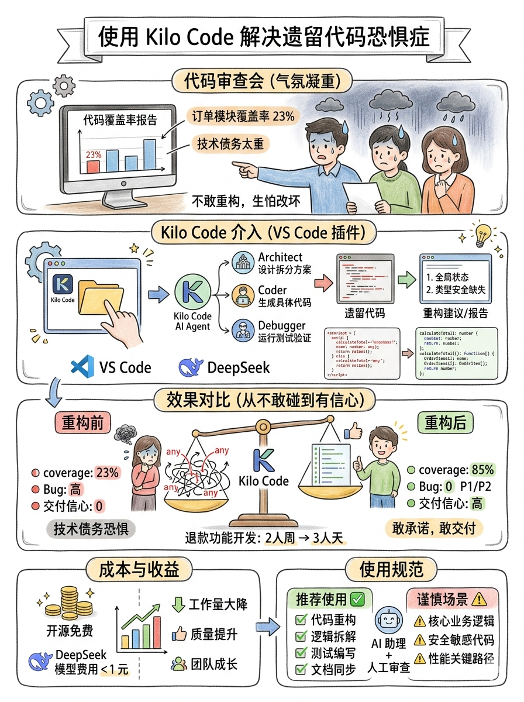
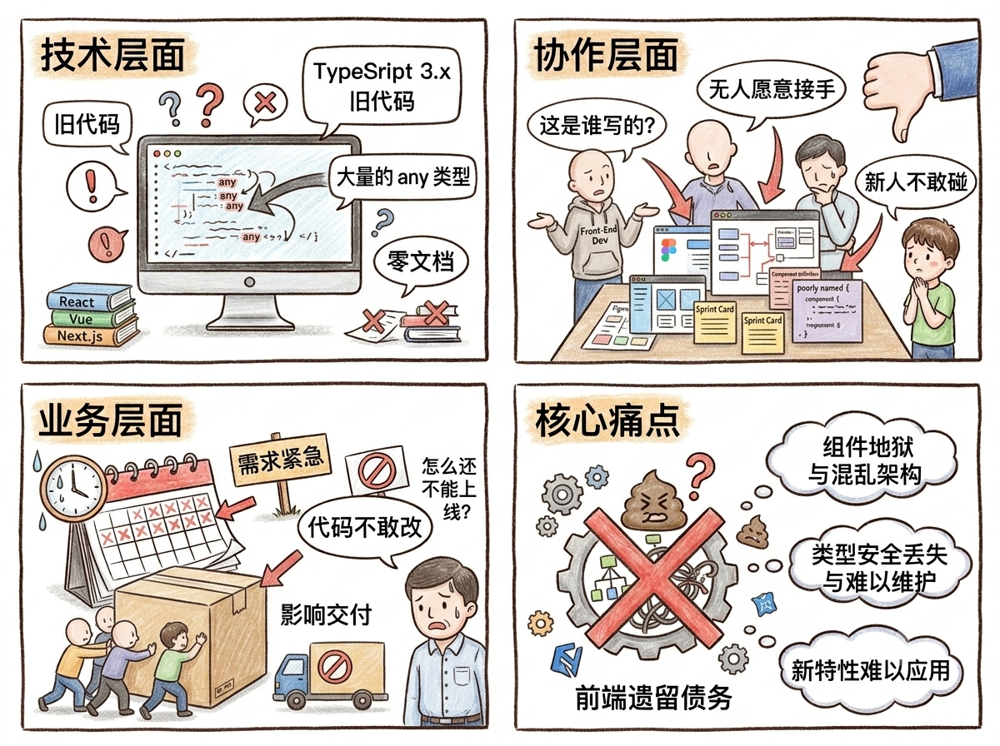
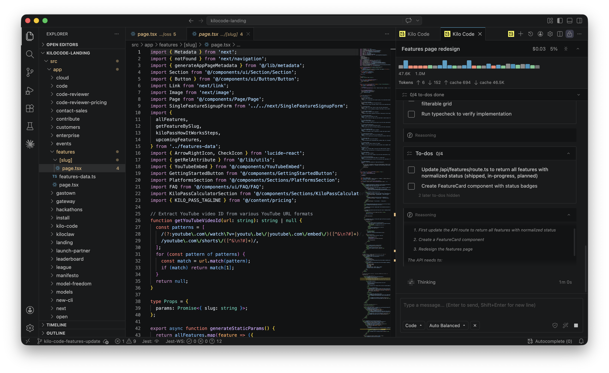
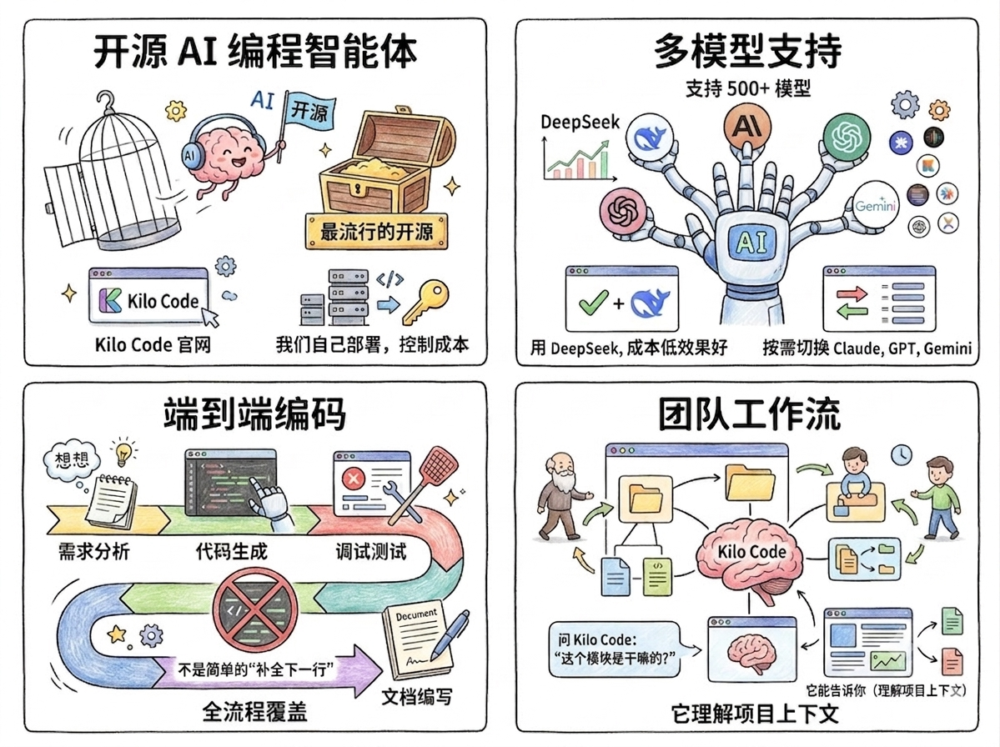
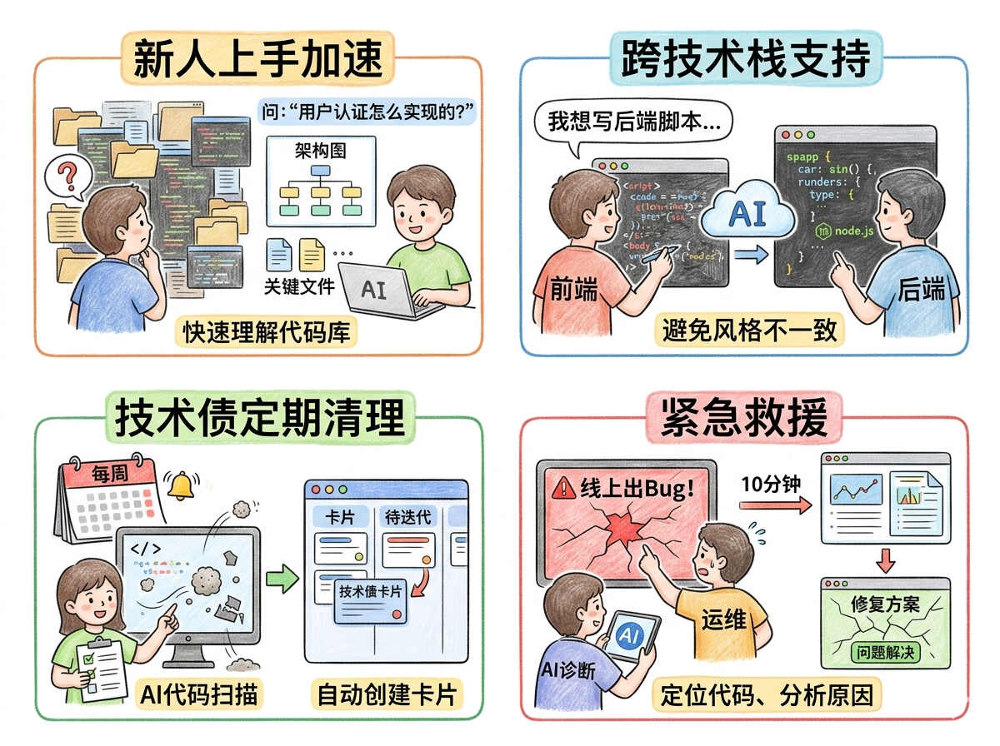

上周四的代码评审会，会议室里的气氛凝重得像要下雨。

明镜（测试工程师）指着大屏幕上的代码覆盖率报告："某教育订单模块，单元测试覆盖率只有23%。每次发版前，我们都提心吊胆。"

清风（前端工程师）小声说："这模块是两年前用TypeScript 3.x写的，当时还没人懂TypeScript。现在要加个退款功能，我都不敢动，生怕改了A坏B。"

云流（全栈组长）看着我（磐石，后端架构师）："磐石，这模块的技术债务太重了。要重构至少2人周，但某教育的退款功能下周就要上线。"

我盯着屏幕上那些充满`any`类型、全局变量、魔法数字的代码，心里清楚：这是典型的"遗留代码恐惧症"。代码看着能用，但没人敢碰。一动就崩，一崩就救火。

"有个工具可以试试，"我说，"Kilo Code。"

## 一、问题：不只是技术债，是团队的心病

"我们遇到的问题，其实有三个层次："我在白板上写：



- 技术层面：TypeSript 3.x旧代码，大量`any`类型，零文档
- 协作层面：没人愿意接手"屎山"，新人不敢碰
- 业务层面：需求紧急，但代码不敢改，影响交付

闪电（全栈工程师）问："Kilo Code能解决？它不就是个高级代码补全吗？"

"不，"我打开Kilo.ai官网，"根据官网介绍，Kilo Code是'End-to-End AI coding'，是'最流行的开源AI编程智能体'。它能理解你的代码库，像团队一样工作。"



## 二、尝试：从怀疑到惊艳

"我们先试试最简单的，"我说，"让Kilo Code分析这个订单模块。"

我在VS Code安装Kilo Code插件，选择DeepSeek模型（官网提到支持500+模型，且目前有一个是免费的）。然后选中订单模块目录，输入：

```text
请分析这个TypeScript订单模块，找出主要的代码质量问题，并给出重构建议。
```

Kilo Code开始工作。它不是简单地扫描文件，而是：

- 读取项目结构：理解模块依赖关系
- 分析代码逻辑：识别业务规则和数据流
- 识别坏味道：找出`any`类型、重复代码、长函数
- 生成报告：按优先级列出问题

2分钟后，它输出一份详细报告：

```text
# 订单模块分析报告

## 严重问题（必须修复）
1. 全局状态管理：orderState是全局变量，导致测试困难
2. 类型安全缺失：47处any类型，类型推断完全失效
3. 错误处理混乱：try-catch嵌套4层，错误被吞没

## 中等问题（建议修复）
1. 函数过长：calculateTotal()函数156行，职责过多
2. 魔法数字：硬编码折扣率、税率、运费
3. 重复逻辑：价格计算逻辑在3个地方重复

## 重构建议
1. 引入状态管理：用Redux或Zustand管理订单状态
2. 类型定义：为订单、商品、用户创建完整接口
3. 错误边界：用Result类型包装可能失败的操作
```

"这比我们自己分析还详细，"清风惊讶，"而且它知道TypeScript的最佳实践。"

## 三、解决：不只是分析，是执行

"但分析只是第一步，"我说，"关键是执行。让Kilo Code实际重构。"

我选中calculateTotal函数，右键选择"Refactor with Kilo Code"，输入：

```text
将这个156行的函数拆分成职责单一的小函数，保持功能不变，添加完整类型定义。
```

Kilo Code启动多智能体协作：

### 3.1 Architect（架构师）：先设计拆分方案


```text
建议拆分为：
- calculateSubtotal: 计算小计
- applyDiscount: 应用折扣
- calculateTax: 计算税费
- addShipping: 加运费
- validateOrder: 验证订单
```

### 3.2 Coder（程序员）：生成具体代码

```typescript
// 新函数1：计算小计
export const calculateSubtotal = (items: OrderItem[]): number => {
  return items.reduce((sum, item) => sum + item.price * item.quantity, 0)
}

// 新函数2：应用折扣
export const applyDiscount = (amount: number, discount: Discount): number => {
  if (discount.type === 'percentage') {
    return amount * (1 - discount.value / 100)
  }
  return Math.max(0, amount - discount.value)
}
```
### 3.3 Debugger（调试专家）：运行测试验证

```text
运行现有测试：通过
新增单元测试：建议添加边界测试
```

整个过程，Kilo Code不是简单地"重写代码"，而是理解业务逻辑后，用更好的架构重新实现。

"最让我惊讶的是，"我说，"它知道TypeScript 4.x的新特性。比如用`satisfies`运算符做类型断言，用模板字面量类型做折扣类型校验。这些都是我们团队还没完全掌握的特性。"

## 四、效果：从不敢碰到有信心

一周后，订单模块重构完成：

### 4.1 代码质量对比

- 测试覆盖率：通过重构解耦了复杂的逻辑，使得原本难以测试的代码变得可测试，最终将测试覆盖率从 23% 提升至 85%。
- TypeScript错误：47个 → 0个
- 圈复杂度：平均15 → 平均3
- 函数长度：平均45行 → 平均12行

### 4.2 团队信心变化

- 清风："现在代码清晰多了，我知道每个函数是干嘛的。
- 闪电："类型定义完整，IDE提示准确，开发效率提升了。"
- 明镜："单元测试好写了，边界条件都覆盖了。"
- 云流："技术债务清理了，后续迭代可预测了。"

### 4.3 业务价值

- 退款功能：原计划2人周，实际3人天完成。
- Bug数量：重构后上线 0 个 P1/P2 Bug。
- 交付信心：团队敢承诺，敢交付。

## 五、什么是Kilo Code？不只是工具

"现在回答最开始的问题，"我在团队分享会上总结，"Kilo Code是什么？"



1. 开源AI编程智能体，“它不是某个公司的封闭产品。根据官网，它是'最流行的开源AI编程智能体'。我们可以自己部署，控制成本。"
2. 多模型支持，"它支持500+模型。我们用DeepSeek，成本低效果好。也可以按需切换Claude、GPT、Gemini。"
3. 端到端编码，"从需求分析、代码生成、调试测试，到文档编写，全流程覆盖。不是简单的'补全下一行'。"
4. 团队工作流，"它理解项目上下文。你离开项目三个月，回来问Kilo Code'这个模块是干嘛的'，它能告诉你。"

## 六、还能解决什么问题？

"基于官网信息和我们的实践，"我列举更多场景：



1. 新人上手加速，"新人静叶刚加入，用Kilo Code快速理解代码库。问'用户认证怎么实现的'，Kilo Code给出架构图、关键文件、注意事项。"
2. 跨技术栈支持，"前端清风需要写Node.js脚本。用Kilo Code生成符合后端规范的代码，避免风格不一致。"
3. 技术债定期清理，"设置定时任务，每周用Kilo Code扫描代码质量，自动创建技术债卡片，分配到迭代中。"
4. 文档同步更新，"代码更新后，让Kilo Code同步更新API文档、注释、README。文档不再滞后。"
5. 紧急救援，"线上出Bug，用Kilo Code分析日志、定位代码、生成修复方案。云帆上周处理一个内存泄漏，Kilo Code 10分钟给出原因和修复。"

## 七、成本与收益

闪电最关心成本："收费吗？"

"开源免费，"我说，"成本只有模型API调用。用DeepSeek，重构订单模块总成本不到1块钱。"

"相比收益："

- 2人周工作量 → 3人天完成。
- 质量提升 → 减少线上Bug。
- 团队成长 → 学习现代TypeScript实践。
- 交付信心 → 敢接复杂需求。

"最好的工具，"我总结，"不是功能最多的，而是能融入工作流、解决真实痛点、有明确ROI的。Kilo Code对我们来说，就是这样一个工具。"

## 八、我们的使用规范

最后，我分享团队制定的 Kilo Code 使用规范：

### 8.1 推荐使用场景

✅ 代码重构、技术债清理
✅ 复杂逻辑拆解
✅ 新功能原型探索
✅ 文档生成与更新
✅ 测试用例编写

### 8.2 需要谨慎的场景

⚠️ 核心业务逻辑首次实现
⚠️ 安全敏感代码，即便是AI生成的安全相关代码，也必须经过资深安全工程师的严格审计。
⚠️ 性能关键路径

### 8.3 工作流程

1. Kilo Code生成代码
2. 人工审查逻辑
3. 运行测试验证
4. 代码评审通过
5. 提交部署

"AI不会取代程序员，"我看着团队，"但会用AI的程序员，会取代不用AI的程序员。Kilo Code就是我们手中的'代码搭档'。它不决定写什么，但决定怎么写更好。"

墨鱼（产品经理）后来问我："磐石，你觉得最大的变化是什么？"

我想了想："以前是'这代码不敢碰'，现在是'让Kilo Code先看看'。从恐惧到探索，这才是最大的变化。"

（磐石，于Kilo Code实践一个月后的技术分享会。）