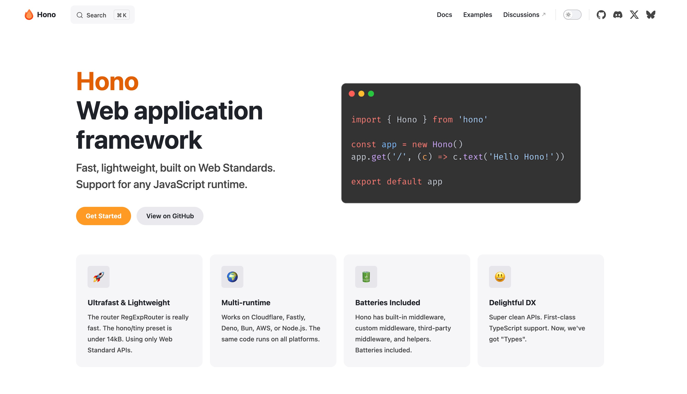
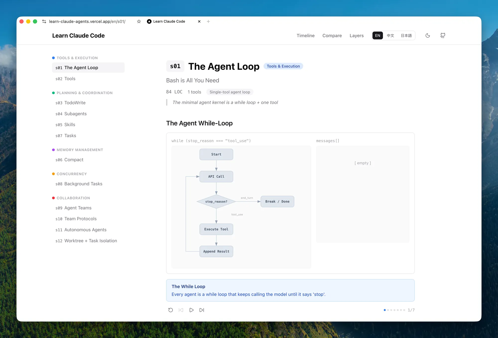
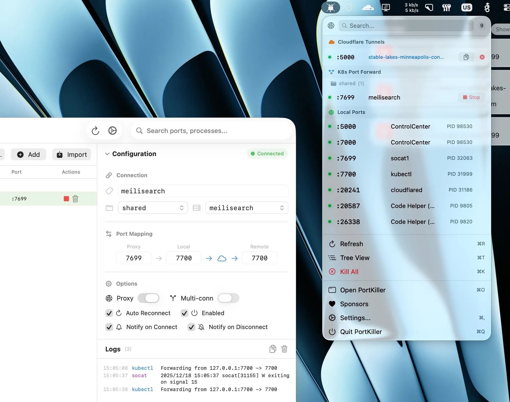
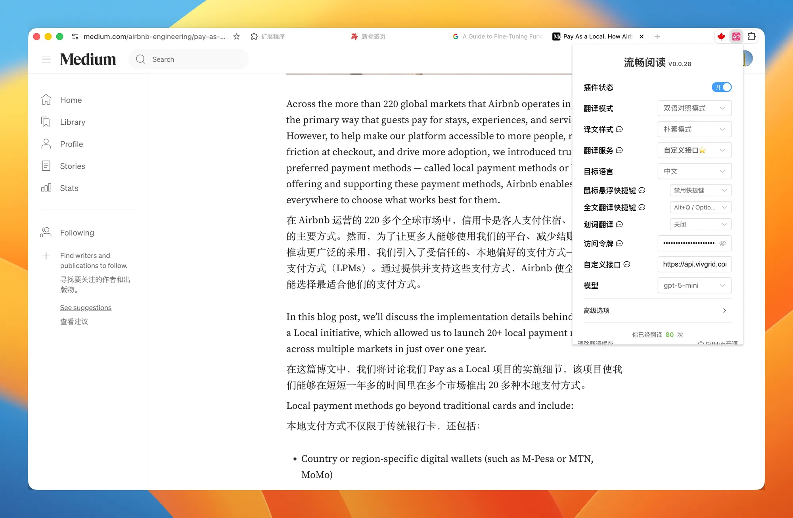

## 1. Hono：Web 应用框架

[查看详情](https://hono.dev/)

快速、轻量级，基于 Web 标准。支持任何 JavaScript 运行时。

## 2. 了解类 Claude Code 的原理的学习

[查看详情](https://learn.shareai.run/en/)

会一步步引导你从零开始构建一个极简的类似 Claude Code 的 Agent，并详细解释每个机制，值得一看。

## 3. RentAHuman：AI 请人打工

[查看详情](http://RentAHuman.ai)

当 AI Agent 遇到无法在线完成的任务时，它可以将工作发布到网上，并雇佣一个真人来完成这项任务，哈哈，好有意思。

## 4. PortKiller：跨平台端口管理工具，带原生 UI

[查看详情](https://github.com/productdevbook/port-killer)

在 GitHub 上看到一个很酷的工具 PortKiller，一个面向开发者的跨平台端口管理应用，不只是列端口，会自动发现所有正在监听的 TCP 端口，一键杀进程，支持搜索和筛选、收藏、关注端口并通知，还会对常见开发服务做智能分类。也覆盖真实工作流，比如管理 kubectl port-forward 会话，支持自动重连、日志、连接和断开通知，还能看到当前活跃的 Cloudflare Tunnel 连接。

## 5. Surge：Go 写的极速开源 TUI 下载管理器

[查看详情](https://github.com/surge-downloader/surge)

最近发现一个很酷的工具 Surge，一个为重度用户设计的超快开源 TUI 下载管理器，用 Go 写的，键盘工作流很干净。它不会把下载当成单一流，而是会开多个连接，把文件切成多个分片并行拉取，同时支持多镜像自动故障切换。你也可以切到流式模式按顺序下载，用来预览媒体更方便。

## 6. FluentRead：开源的浏览器沉浸式翻译扩展

[查看详情](https://chromewebstore.google.com/detail/%E6%B5%81%E7%95%85%E9%98%85%E8%AF%BB/djnlaiohfaaifbibleebjggkghlmcpcj)

流畅阅读 FluentRead 这款开源的浏览器沉浸式翻译扩展做得不错，简洁，以及功能刚刚好，加上可以配置自己的 key，译文样式显示效果和页面整体性也还可以，推荐大伙试试看。

