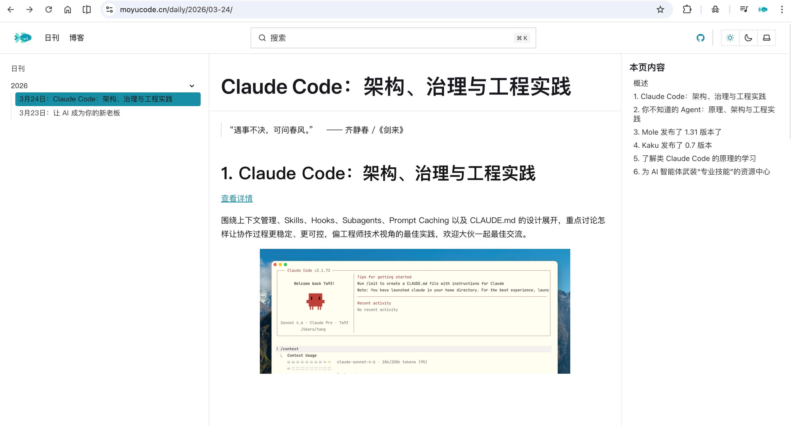
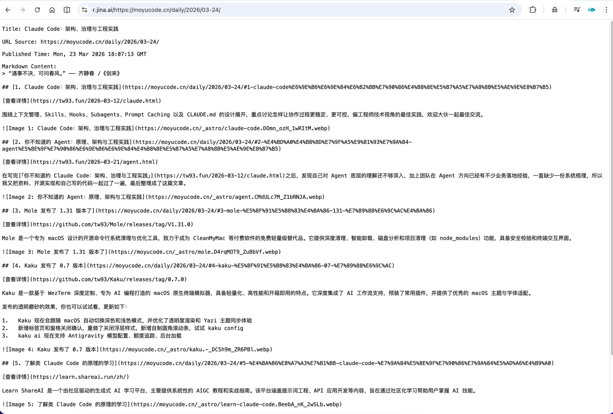
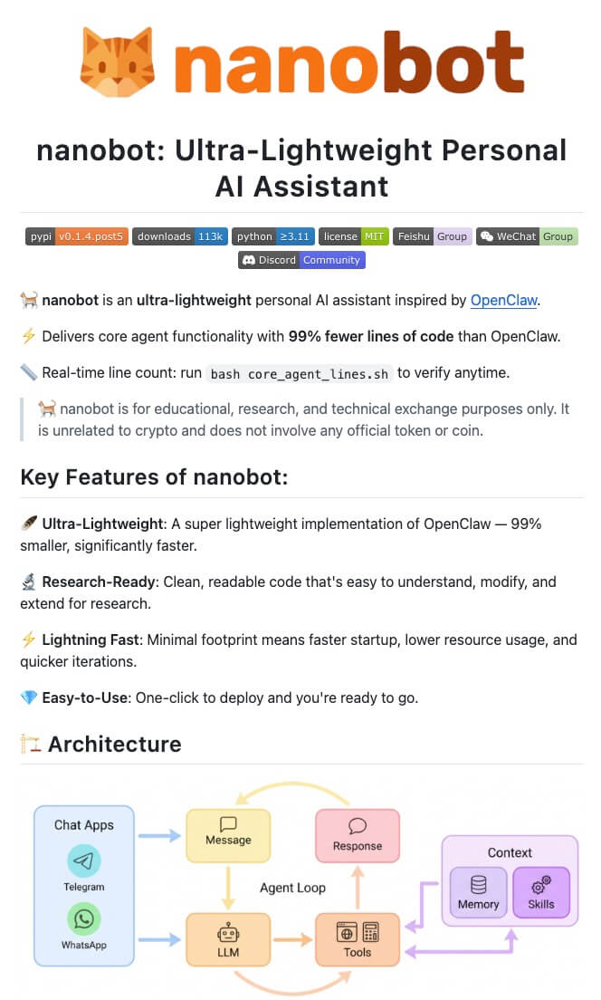
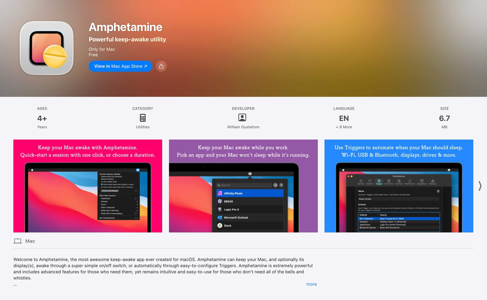

## 1. Claude 全场景实操案例库

[查看详情](https://claude.com/resources/use-cases)

一站式解决了“Claude 能干什么”和“怎么干得漂亮”两个问题。涵盖了从策略分析到底层开发的数十个高频场景，每一个案例都精准对标实际痛点。想解锁 Claude 的真实战斗力？看这一篇就够了。高效工作的秘密，都在这个链接里。

## 2. 告别复杂爬虫，一键搞定 RAG 数据清洗

[查看详情](https://r.jina.ai/)

做 RAG 或 AI Agent 最头疼的就是网页数据清洗？Jina Reader API 可能是目前的最佳方案。它通过自研的 ReaderLM-v2 模型，能将复杂的 HTML 甚至 PDF 极速转化为结构化的文本。

核心优势： 支持动态内容抓取、自带搜索增强（s.jina.ai）、输出格式对 LLM 极度友好。省去写正则和解析 DOM 的烦恼，一个 API 前缀，让你的 AI 应用直接拥有全网实时知识库！

如何使用：直接在 `https://r.jina.ai/` 贴上 url 网页链接地址就好。

## 3. pi：一个 小 Agent 框架

[查看详情](https://github.com/badlogic/pi-mono)

AI 代理工具包：编程代理 CLI、统一 LLM API、TUI 和 Web UI 库、Slack 机器人、vLLM pod

## 4. Nanobot，是消失在你的日常工作流里

[查看详情](https://github.com/HKUDS/nanobot)

现在的我，已经很少去“找” AI 聊天了，因为两个 Nanobot 就稳定地运行在我的本地后台。一个懂我的代码逻辑，一个懂我的生活节奏。
不需要特意打开，不需要反复调试。它就像一个默默干活的数字学徒，在我写代码间隙、在我通勤路上，帮我把那些繁琐的前置工作悄悄做完。这种“开箱即用”且“自我迭代”的轻量感，是任何云端产品给不了的。如果你也向往一种更自然、更可控的 AI 交互，Nanobot 绝对值得你给它在电脑里留个位置。

## 5. Amphetamine：让你的电脑永远“在线”

[查看详情](https://apps.apple.com/us/app/amphetamine/id937984704)

如果你像我一样在本地跑着 Nanobot 或各种自动化脚本，最怕的就是系统自动休眠导致服务挂掉。Amphetamine 是目前 macOS 上最强大、最优雅的防休眠工具。

它不是简单的“不关机”，而是可以通过极其精细的配置（比如：连接特定 Wi-Fi 时保持唤醒、运行特定 App 时不准黑屏）来精准接管系统电源。配合定时自起脚本，它能让你的 Mac 变成一台 7x24 小时永远待命的本地服务器。无论身在何处，只要你想，你的“数字分身”永远在那等候指令，这种绝对掌控感真的会上瘾！

## 6. Maple：浏览器书签工具

[查看详情](https://github.com/tw93/Maple)

书签栏可能会占据浏览窗口并影响专注力，所以我经常将其隐藏。然而，这会使访问书签变得不方便。因此，我开发了 Maple Bookmarks 扩展。只需使用快捷键，你就可以快速访问你的书签，甚至输入可以即时搜索，这非常实用和方便。

