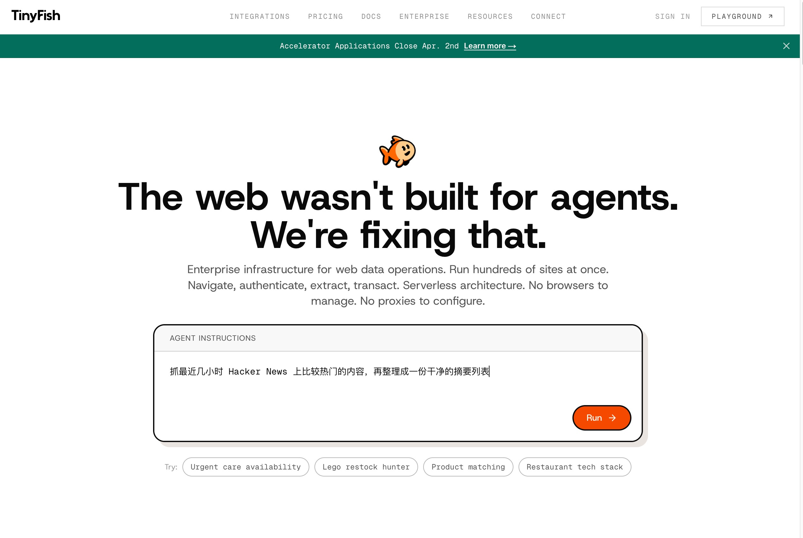
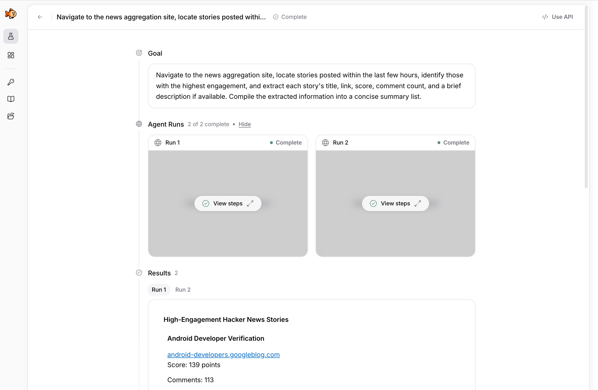
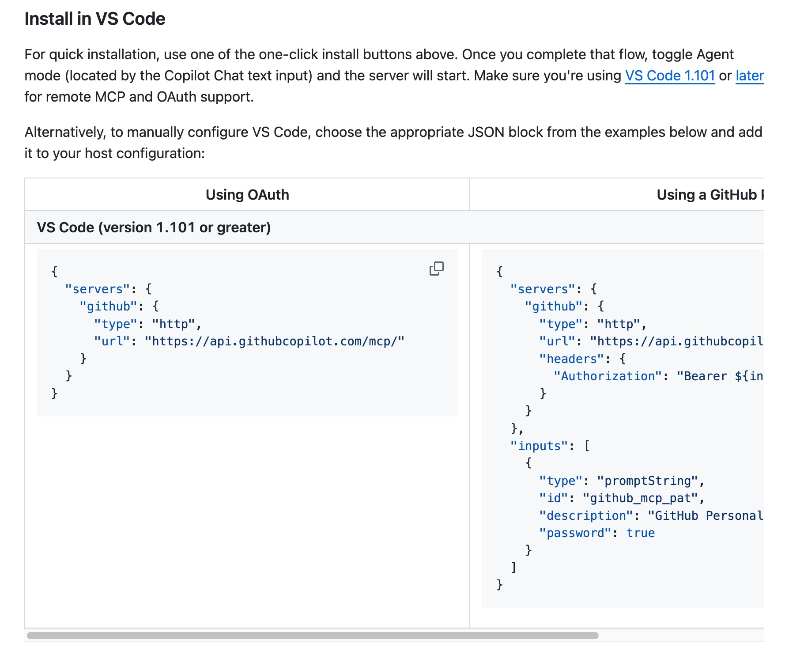
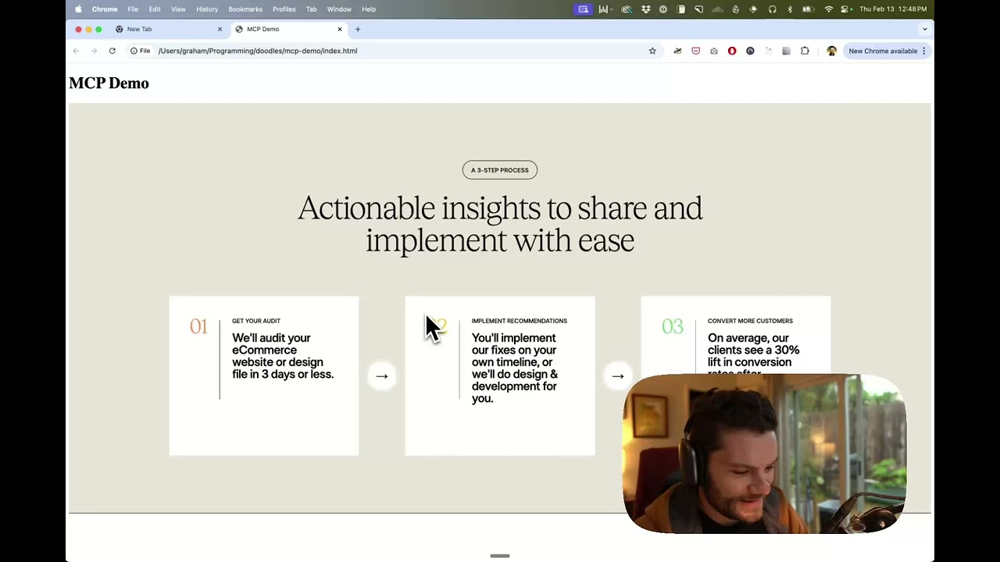
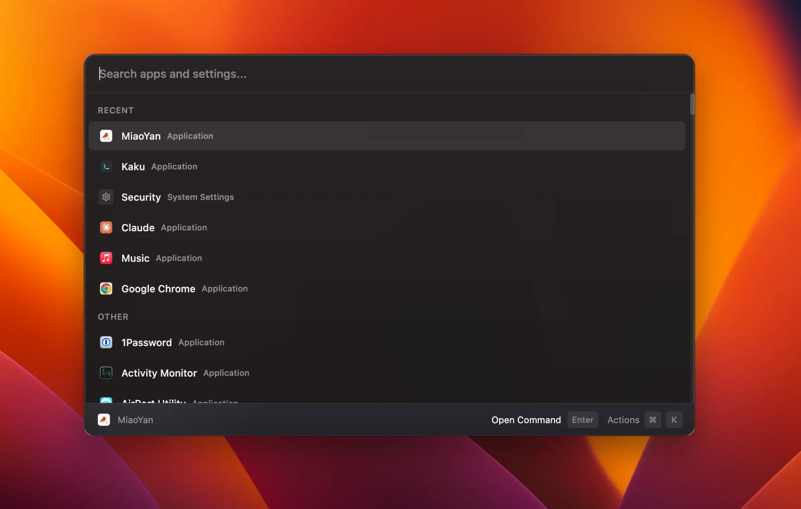

## 1. 扔掉复杂爬虫，像真人一样秒读全网数据

[查看详情](https://tinyfish.ai)

TinyFish 重新定义网页数据抓取，通过智能大脑将复杂网页瞬间转化为清晰报表，能应对登录验证和复杂结构。该平台支持大规模任务并发，旨在替代传统爬虫，实现数据自动化获取效率的飞跃。

比如我输入：抓最近几小时 Hacker News 上比较热门的内容，再整理成一份干净的摘要列表，就可以得到如下结果：

## 2. 用 AI 自动化你的 GitHub 工作流

[查看详情](https://github.com/github/github-mcp-server)

GitHub MCP Server 允许 AI 直接访问代码库、Issue 和 Pull Request，让 GitHub 成为 Copilot 可操作的智能工具。该插件实现了代码上下文的自动化处理，消除了浏览器与编辑器间的繁琐切换，显著提升开发效率。

## 3. 告别切图：让 AI 盯着 Figma 帮你写代码

[查看详情](https://github.com/GLips/Figma-Context-MCP)

Figma Context MCP 打通了设计到代码的流程，让 AI 助手能直接读取 Figma 设计图，实现精准的视觉还原。它赋予 AI 视觉感知能力，自动提取图层属性和布局，显著提升前端代码编写和组件构建的效率。

## 4. 嘴强绘图王：AI画出你的灵感

[查看详情](https://github.com/excalidraw/excalidraw-mcp)

Excalidraw MCP 为大模型接入了 Excalidraw 画板，让AI能够直接生成具有手绘风格的架构图、流程图或视觉草图。该项目告别了冷冰冰的像素风，通过对话即可让创意瞬间转化为亲切、可编辑的草图，大幅提升了头脑风暴和逻辑梳理的效率。

## 5. 有道龙虾：7×24小时全场景AI助理

[查看详情](https://lobsterai.youdao.com/)

网易有道推出的桌面级Agent“有道龙虾（Lobster AI）”，不仅能聊更能办事。它支持通过钉钉、飞书、企微及QQ远程指挥电脑，即便人不在位也能完成PPT生成、复杂数据分析、代码编写及小游戏制作。其独特的Skills插件系统可无限扩展技能，为您打造一个全天候在线、懂逻辑且能落地的“有脑有手”数字员工，彻底解放您的双手。

## 6. SuperCmd：MacOS 全能开源启动器

[查看详情](https://github.com/SuperCmdLabs/SuperCmd)

SuperCmd 是一款专为 MacOS 打造的开源启动器，不仅兼容 Raycast 插件生态，更集成了 AI 助手、语音输入与剪贴板管理等核心功能。凭借极致的响应速度和简洁界面，该工具能显著提升工作流效率，重塑 Mac 操作体验。

