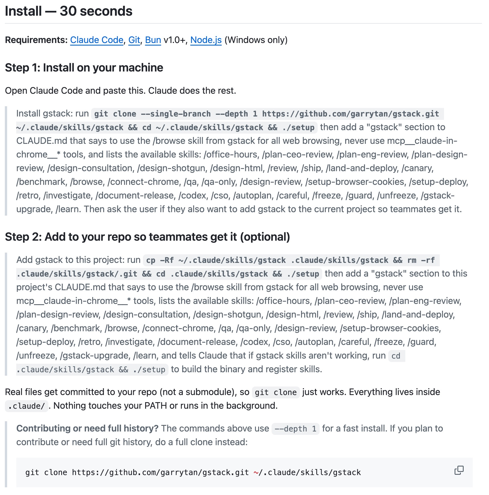

## 1. 让 AI 像硅谷大神帮你写代码

[查看详情](https://github.com/garrytan/gstack)

gstack 是由 Y Combinator CEO Garry Tan 开源的 Claude Code 增强工具，它将 YC 的项目评估和工程管理思维硬编码进 AI 工作流。该项目内置 20 多个专业角色（如架构师、QA），并支持持久化无头浏览器自动化操作，助力开发者一个人像高效的技术团队一样，从思考产品逻辑到自动修复 Bug。

