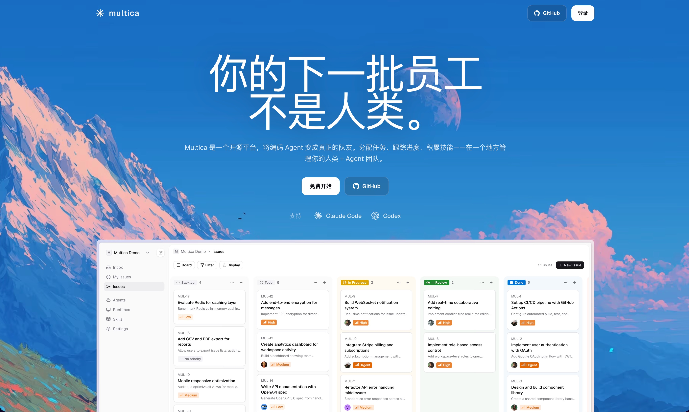
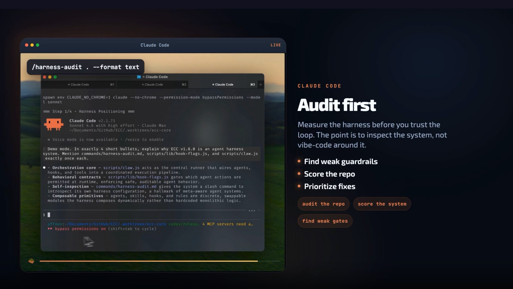

## 1. 你的下一批员工不是人类

[查看详情](https://multica.ai/)

Multica是一款开源的AI原生任务管理平台，通过可视化界面让Claude Code等编程智能体成为高效的“队友”。它实现了人机协同开发，将繁琐的命令行转化为可视化管理，助力团队在统一空间内实现技能积累与进度追踪，让两名工程师发挥出二十人的战斗力。

## 2. ECC Tools：AI智能体协作中枢

[查看详情](https://ecc.tools/)

ECC Tools 是专为 GitHub 生态打造的开源 AI 智能体编排系统。它将代码库历史转化为可评审的 PR，并提供 AgentShield 安全审计与特定领域的“技能”文件（Skills），让 Claude Code 等 AI 助手深度理解您的业务模式。通过自动化 Hook 和持续学习机制，ECC 能够精准适配团队风格，在保障安全基线的同时，将零散的 AI 工具升级为高效、可移植的团队生产力引擎。

