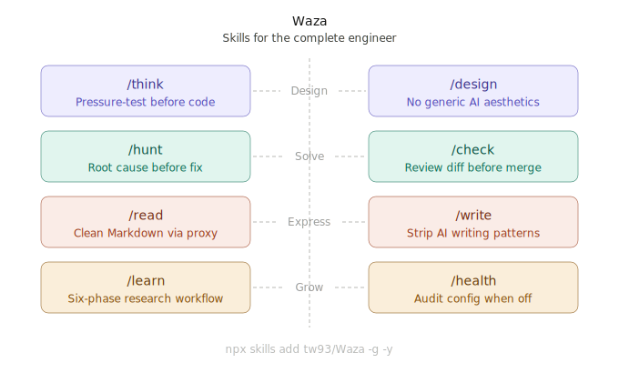
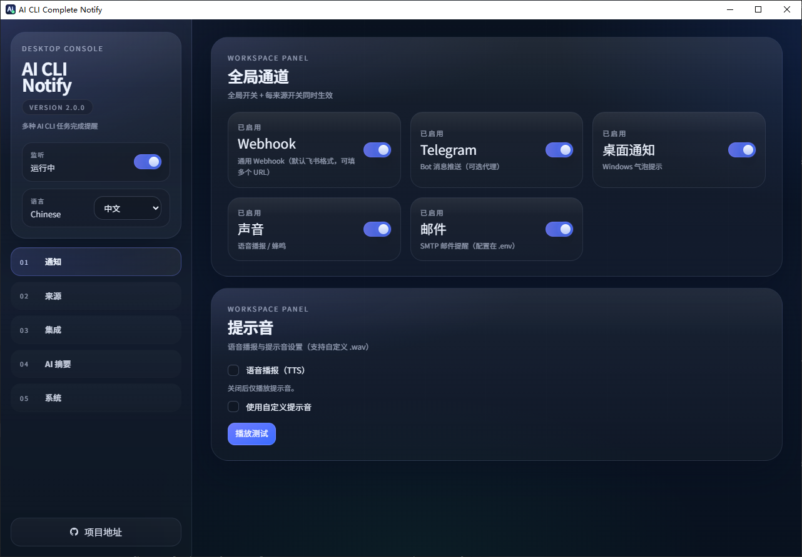

## 1. Waza 我的工程师分身 Skill

Waza（技）是日本武术术语，指一种经过练习直至成为本能的动作。

一个优秀的工程师不仅仅会写代码。他们会思考需求，审查自己的工作，系统地调试，设计感觉有目的性的接口，并阅读原始资料。他们写得很清晰，通过产出内容来学习新领域，而不是消费内容。

AI 让你更快。它不会让你思考更清晰，交付更谨慎，或理解更深入。Waza 将每一个这些习惯都变成 Claude 可以执行的技能。

[查看详情](https://github.com/tw93/Waza)

## 2. AI命令行任务完成自动提醒工具

[查看详情](https://github.com/ZekerTop/ai-cli-complete-notify)

面向 Claude Code / Codex / OpenCode / Gemini 的多通道AI CLI 任务完成提醒，支持耗时阈值、桌面端与命令行、通用 Webhook（飞书/钉钉/企微）、Telegram、邮件、桌面/声音提示，配备自动监听日志，AI摘要等功能

