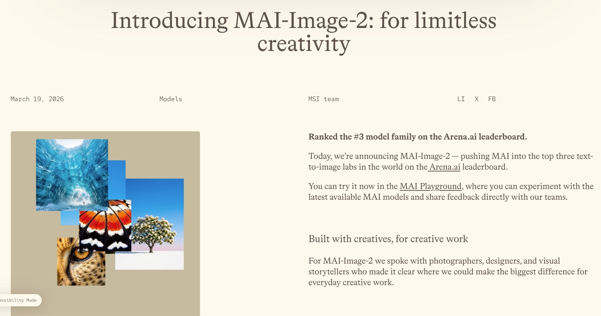
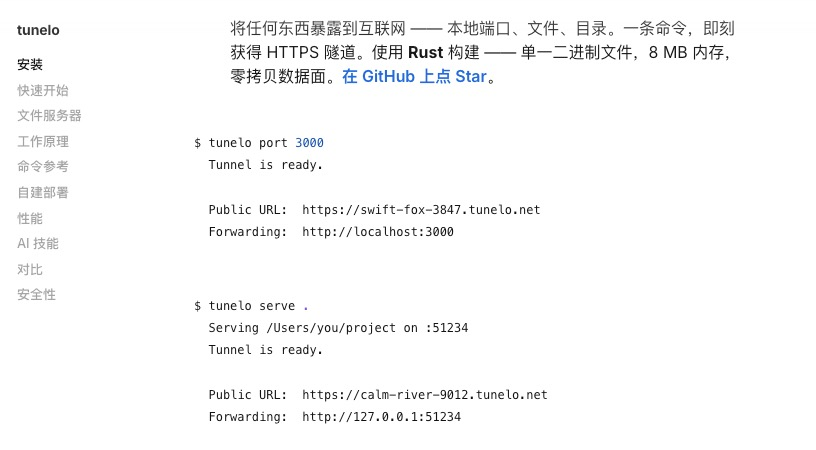
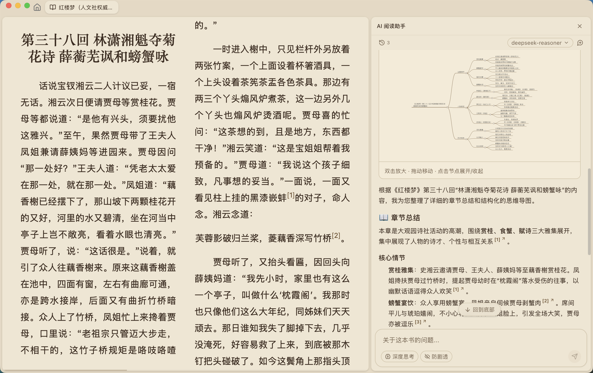
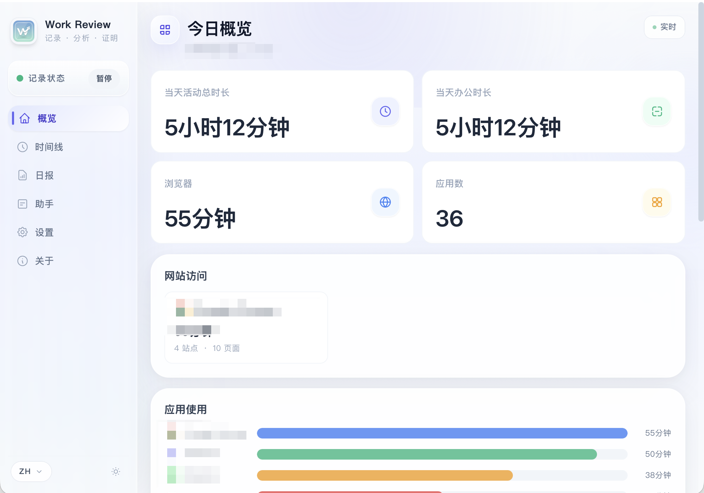

## 1. 微软MAI-Image-2：重塑视觉创作

[查看详情](https://microsoft.ai/news/introducing-MAI-Image-2/)

微软官方正式推出 MAI-Image-2，这款全新的文本生成图像模型在 Arena.ai 排行榜上已跻身全球前三。它深度融合了摄影师与设计师的专业反馈，主打极致拟真的自然光影与肤色表现。更突破性地解决了 AI 画图“没文化”的难题，能精准渲染海报、信息图中的文字内容。无论是制作电影感大片还是专业设计稿，它都能大幅减少后期修图，让创意即刻成真。

该模型在使用上有明确规范：首先，内置严格的审核机制，会自动拦截争议或冒犯性内容；其次，免费用户每日限领 15 次生成额度，且单次创作需间隔 30 秒；在功能上，目前专注于纯粹的“文生图”模式，仅支持 1:1 的正方形比例，暂不具备图像二次编辑与加工能力。

## 2. 下一个 App 很可能是无头应用

[查看详情](https://tuananh.net/2026/03/18/why-your-next-mobile-app-is-probably-headless/)

本文深度剖析了移动应用开发的无头化（Headless）趋势，指出用户正减少直接打开App的习惯，转向通过系统组件、AI助手直接获取服务。无头化架构将核心功能与复杂界面解耦，通过API让服务无处不在，是服务导向时代的必然选择 [1]。对于开发者而言，理解这种服务重于形式的转型，将服务嵌入系统交互中，是打造下一个爆款App的关键。

## 3. Tunelo：内网服务一键安全上线

[查看详情](https://tunelo.net/#zh)

Tunelo是一款专为开发者设计的极简内网穿透利器。它基于Rust语言开发，采用更先进的QUIC协议进行隧道传输，不仅连接稳定，更拥有极低的时延和极小的内存占用（约8MB）。通过简单的命令行操作，您可以瞬间将本地运行的Web服务、API或开发环境暴露到公网，彻底解决无公网IP带来的远程访问难题。
除了核心的穿透功能，Tunelo还内置了强大的Web文件浏览器，支持代码高亮、Markdown渲染以及多种音视频文件的直接预览。它无需繁琐的注册流程，下载即可免费使用。无论您是需要向客户演示项目、调试Webhook，还是构建个人私有云，Tunelo都能提供丝滑且安全的连接体验。

## 4. Flare Stack：全栈云原生博客

[查看详情](https://github.com/du2333/flare-stack-blog)

Flare Stack 是一款基于 Cloudflare Workers/D1/R2 技术栈打造的现代开源全栈博客 CMS，深度集成动态模块。该项目具备原生高性能，内置丰富编辑与后台功能，助力开发者极速部署极低成本的个人站点。其独特的主题契约设计与 React 19 技术栈，完美契合极致开发体验需求。

## 5. ReadAny：全格式本地AI阅读器

[查看详情](https://github.com/codedogQBY/ReadAny)

ReadAny 是一款聚焦隐私的本地化 AI 阅读器，支持 PDF、EPUB 等多种文档格式，助力高效阅读与分析。核心优势在于支持接入 Ollama 等本地大模型，确保所有文档的提问、总结及深度拆解均在本地完成，告别数据泄露风险。其界面简洁克制，专注于核心的阅读与 AI 交互体验。无需复杂配置，即开即用。如果您在寻找一款既能梳理复杂专业文档，又能保障数据安全的知识库辅助工具，ReadAny 是理想选择。

## 6. Work Review: 本地工作轨迹

[查看详情](https://github.com/wm94i/Work_Review)

Work Review 会在后台持续记录你当天使用过的应用、访问过的网站、关键窗口和屏幕内容，再把这些离散片段整理成一条可回看、可追问、可复盘的工作轨迹。

不需要手动打卡，也不用事后回忆今天干了什么
概览、时间线、日报、工作助手共用同一份底层记录
既能看统计，也能直接追到具体页面、窗口标题和上下文截图
支持简体中文 / English / 繁體中文三种界面语言，日报会按当前语言分别生成与切换
支持轻量模式、按小时活跃度视图、日报 Markdown 导出和多屏截图策略切换
现在还提供 桌面化身 Beta，用更轻量的桌宠状态反馈陪你工作

