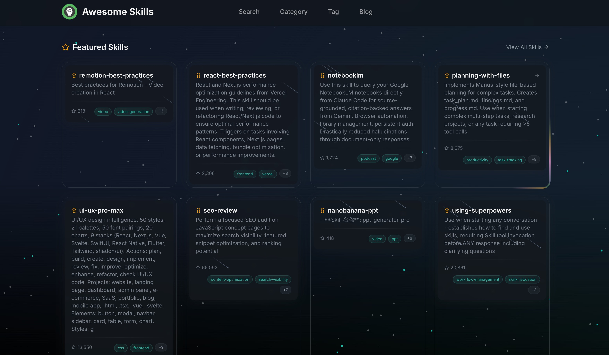
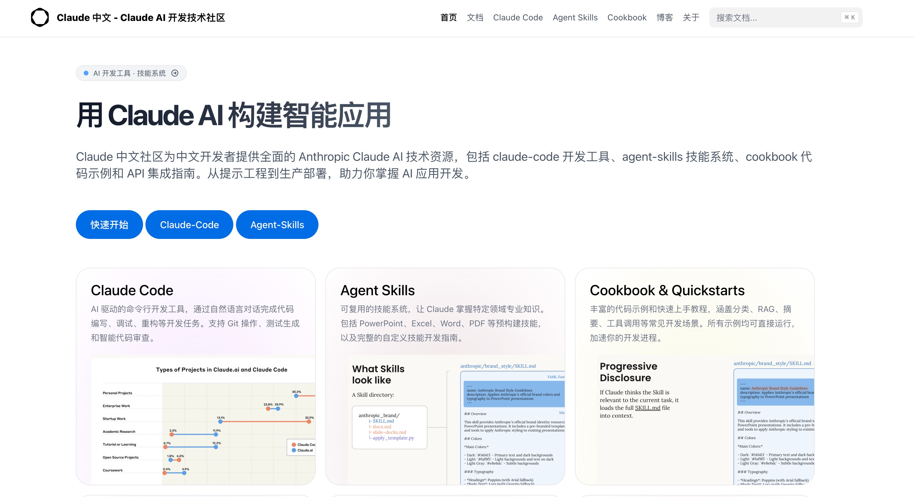

## 1. 为 AI 智能体武装“专业技能”的资源中心

[查看详情](https://awesomeskill.ai/)

随着 AI 智能体（Agents）从单纯的聊天转向执行复杂任务，如何让它们具备专业领域的“操作直觉”变得至关重要。AwesomeSkill.ai 是一个专门为 Claude、Codex 等 AI 助手打造的技能市场，汇集了从 API 开发、数据科学到自动化测试等各类 SKILL.md 标准化指令集。通过该平台，开发者可以轻松地为 AI 注入特定工作流的“肌肉记忆”，让 AI 助手成为真正懂业务、懂工具的数字雇员。

## 2. Claude 中文社区

[查看详情](https://claudecn.com/)

Claude 中文社区为中文开发者提供全面的 Anthropic Claude AI 技术资源，包括 claude-code 开发工具、agent-skills 技能系统、cookbook 代码示例和 API 集成指南。从提示工程到生产部署，助力你掌握 AI 应用开发。

